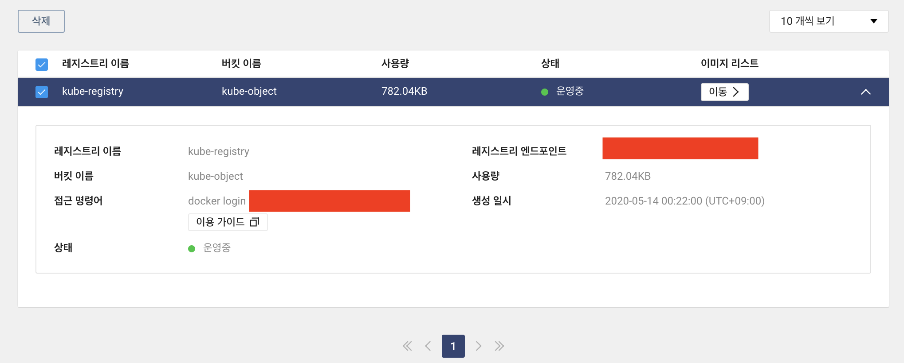
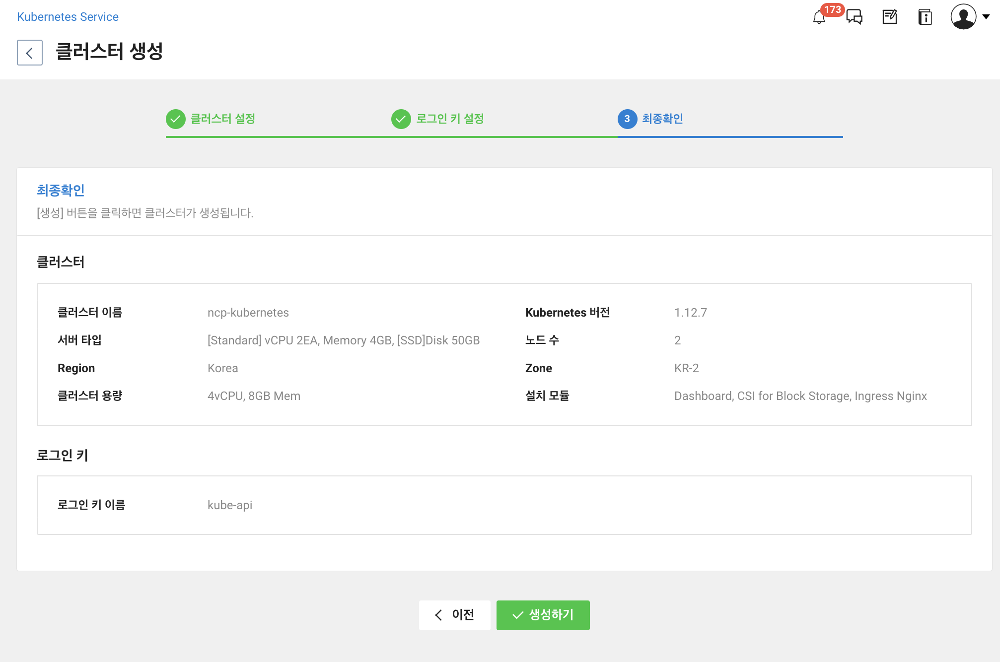

# Naver Kubernetes Service(NKS) Sample Test


***Base Code**: https://github.com/awslabs/amazon-ecs-nodejs-microservices*


## 가정사항

- NCloud의 계정이 존재하며 NCP에 대한 기본적인 이해가 있음
- Kubernetes API Object를 이해함
- 환경 : macOS Catalina
- 필자는 현 예제를 위해 Object Storage 버킷을 생성해둔 상황


## 참고사항

- 20년 5월 14일 기준으로 작성됨
- Manifest 수정시 반복되는 Container Repo의 경우 In 명령어를 통해 한번에 바꾸는 것을 권장함


## Container Registry 생성 

- 생성해둔 Object Storage를 활용하여 Container Registry 생성


- 생성한 레지스트리에 접근 (접근 명령어 참고)
- 처음에 접근할 경우 Access key 및 Secret key가 필요하나 필자는 기존에 로그인을 해놓은 상황




## Kubernetes Cluster 생성

- kubernetes setting
- Zone: KR-2 / 노드 수 :2
- NKS의 Ingress는 Nginx를 사용하며 처음에 셋팅하지 않는 경우 수동으로 설치하면 됨
  - 20년 5/14일 기준으로 KR-1과 SGN-1은 법인 고객만 이용 가능(https://docs.ncloud.com/ko/nks/nks-1-1.html)


- 로그인 키는 기존의 보유하는 것이 없으면 새롭게 만들어야함
- 클러스터 정보 확인



- 클러스터 생성은 수분~수십분 정도 걸림


## 동작 확인

### 설명 1번 monolith path에서 koa framework 동작

```bash
npm install
node server.js
```

- 아래와 같이 동작화면을 확인


## 단순 컨테이너화 확인

### 설명: 2번 container path는 1번에서 작성한 코드를 그대로 컨테이너화하여 동작

#### 이미지 생성

- docker가 제대로 동작하는지 확인

```bash
docker build -t mono:test .
docker run --name="demo-container" -p 3000:3000 mono:test
```

(1번 동작화면과 동일한 화면이 보여야 함)

- NKS에 구축하기 위해 Container Registry에 Push
- Push된 Container Registry에서 Tag 값은 메모해야 함

```bash
source imagepush.sh
```


#### Kubernetes에 배포

- 클러스터 접속 (콘솔에서 설정파일을 다운받고 path 설정, 뒤의 숫자 4개는 난수)

```bash
export KUBECONFIG=~/.kube/kubeconfig-2003.yml
```

- 접속 및 클러스터 확인

```bash
kubectl cluster-info
```


- private repository를 활용하기 위해 secret에 등록해야함 (https://docs.ncloud.com/ko/container/ncr-1-3.html)
  - --docker-server = container registry endpoint

```bash
kubectl create secret docker-registry regcred --docker-server=<registry-end-point> --docker-username=<access-key-id> --docker-password=<secret-key> --docker-email=<your-email>
```

- manifest 수정

  - manifest path에서 deploy.yaml 수정
  - Container Registry를 사용하기 위해 template의 spec에서 Secrect에 대한 설정 추가
  - 컨테이너에 대한 이미지 및 태그 값 업데이트

  

- 배포 (deployment)

```bash
kubectl create -f deploy.yaml
kubectl get pods
```


- Expose (Service)

```bash
kubectl create -f svc.yaml
kubectl get svc
```


#### Mono Infra 삭제

```bash
kubectl delete -f deploy.yaml
kubectl delete -f svc.yaml
```


## 마이크로 서비스 컨테이너화 확인

### 설명: path단위로 나누어서 배포 진행 (3. msa-container 확인)

#### 이미지 생성

- 이미지 생성 후 Container Repostry에 Push

```bash
source push.sh
```


#### Kubernetes에 배포

- Container Registry를 사용하기 위해 template의 spec에서 Secrect에 대한 설정 추가
- deploy.yaml파일에서 각 이미지의 주소 및 태그 값 업데이트 필요 (콘솔 확인)
- 배포 (deployment)

```bash
kubectl create -f deploy.yaml
kubectl get pods
```


- Expose (Service)
  - Ingress로 묶기 위해서는 deployment를 nodeport로 expose

```bash
kubectl create -f svc.yaml
kubectl get svc
```


- Ingress
  - 현재 nginx controller가 동작하는지 확인 필요
  - 외부에서 접근할 수 있도록 Ingress Service 확인
  - 없는 경우 수동으로 설치(참고: https://docs.ncloud.com/ko/nks/nks-1-4.html)

```bash
kubectl get pods -n ingress-nginx
```


```bash
kubectl get svc -n ingress-nginx
```


- annotation 설정
  - Nginx Ingress를 사용하므로 annotation 설정 필요


- Ingress 배포

```bash
kubectl create -f ingress.yaml
kubectl get ingress
```

- 결과 확인


